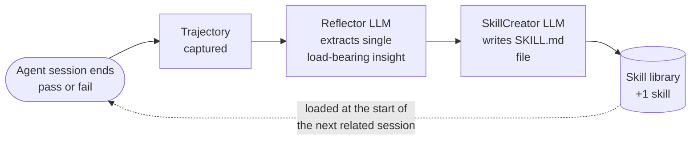

# AI agents are amnesiacs.

*Post 1 of 3 in the ContinuumAI series. Published 2026-06-02.*

## The amnesiac problem

Pick any coding agent you might be using — *Cursor, Claude Code, Aider, OpenHands, Codex, whatever your platform team is building in-house* — and they all share one structural property: **no memory across sessions.**

Each task starts from scratch. The agent works through the problem, makes mistakes, eventually finishes (or doesn't), and then everything it learned evaporates the moment the conversation ends.

**For an individual developer this is mildly annoying:**

- Your agent reaches for `pip` even though your repo has been on `uv` since spring — or for `jest` even though you migrated to `vitest` last quarter — every new session, same wrong tool, fresh
- It re-proposes the dead-end approach you and your team explicitly rejected on Slack three weeks ago, because nothing in its context remembers any of that
- You spend more time re-explaining the project's basics — *which logger, which test runner, which branch ships to prod, where the deploy script actually lives* — than you spend on the actual change you opened the chat for

**For an engineering organization this is significantly more expensive:**

- Every engineer's agent runs through the same gotcha library independently
- The skill your senior engineer's agent acquired last quarter does **not** transfer to the junior engineer's agent next quarter
- The institutional knowledge your humans accumulate across PRs, postmortems, design reviews, and onboarding wikis has no analog for agents
- ***Your humans compound. Your agents do not.***

This is the pattern we keep seeing in agent pilots: useful out of the gate, then a plateau that never quite breaks. The agent keeps doing the same tasks, keeps getting tripped up by the same things, and the next model upgrade doesn't move it past the plateau either.

Of course it doesn't — there's no mechanism for it to.

**And throwing a bigger model at it doesn't help.** Frontier models can already chew through most Terminal-Bench 2.1 tasks if you give them enough tokens. Capability isn't the bottleneck. The bottleneck is that nothing about the *system around the model* carries yesterday's lesson into today.

What's missing is the five-line note your senior engineer would jot down after spending forty minutes on a gotcha. That's all a skill is, really.

## What ContinuumAI does

**ContinuumAI is the missing layer between agent sessions.** It captures what an agent learned in one session, turns it into a short reusable artifact, and makes it available to every related session that follows — in the background, with no human curation step in between.

Here's the loop:

Two LLM calls. One Markdown file out per session. The library accumulates: a skill authored at 11 p.m. on a Tuesday is available to your colleague's agent at 9 a.m. on Wednesday. And the same SKILL.md keeps working regardless of which model your routing layer (*OpenRouter, AWS Bedrock, direct providers*) hands the next request to.

**What the loop is NOT:**

- ❌ No model weights touched, no fine-tuning, no RL
- ❌ No vector store, no embedding database
- ❌ No human curation, no manual playbook maintenance
- ❌ No vendor lock-in — skills are plain Markdown files in a folder

## The compounding cost advantage

As long as agents keep starting from zero every time, **every session pays the cost of re-discovering the same problems**. The dollar cost gets ugly fast — a team running thousands of agent sessions a day across hundreds of engineers is paying for the same gotcha to be discovered, again, in each of those sessions. The wall-clock cost is worse: every developer is waiting while the agent re-explores what was already known.

**Once you capture the lesson once, that cost is paid once.**

| Audience | What changes |
|---|---|
| **Individual developer** | An hour saved every time a repeated gotcha shows up; an agent that grows quietly sharper at *your* stack week after week |
| **Engineering organization** | Monthly agent inference bill drops meaningfully (we quantify this in Post 2); institutional knowledge becomes a *capturable, replayable, auditable artifact* the same way commits are; team-wide compounding starts happening across every PR |

The ROI shape is unusual for an AI product: **it improves the longer you run it, without model upgrades.**

## Measuring it on Terminal-Bench 2.1

To measure the loop we needed a benchmark that:

1. **Tests multi-step, long-horizon agent work** — so a skill has real content to encode
2. **Has a published frontier reference** — so any lift is interpretable
3. **Allows clean K-run aggregation** — so the numbers are comparable across teams

[Terminal-Bench 2.1](https://www.tbench.ai/leaderboard/terminal-bench/2.1) fits all three. 89 long-horizon coding and systems tasks: SQLite-WAL recovery, build-chain debugging, image-processing pipelines, reverse-engineering puzzles, network-protocol implementations, environment-configuration problems. Each task has a programmatic verifier. The current leaderboard top is *Codex CLI + GPT-5.5* at 83.4 %; second is *Claude Code + Opus 4.8* at **78.9 %**. Both run on frontier closed models.

We ran the experiment with **GLM-5.1 as the executor** across three conditions:

- **A — baseline**: GLM-5.1 with no skill loaded
- **B — GLM-authored skill**: GLM-5.1 reads a SKILL.md authored by GLM-5.1 from its own prior failure
- **C — Opus-authored skill**: GLM-5.1 reads a SKILL.md authored by Claude Opus 4.6 from the same prior failure

K=3 attempts per task. TB-standard aggregated score. 87 of 89 tasks measured under every condition.

### Results

| Stack | TB-2.1 aggregated score | Lift vs baseline |
|---|---|---|
| Claude Opus 4.8 (leaderboard #2) | 78.9 % | *frontier reference* |
| **A**: GLM-5.1 baseline (no skill) | **59.4 %** | — |
| **B**: GLM-5.1 + GLM-authored skill | **62.8 %** | **+3.4 pp** |
| **C**: GLM-5.1 + Opus-authored skill | **64.0 %** | **+4.6 pp** |

A **+4.6-point lift** on a benchmark at this hardness — *from a single failure trajectory per task, with no iterative refinement and no validation gate* — is the headline. For context, published results in this research area have reported:

- **+9 points** for trajectory-only approaches on the easier predecessor benchmark (TB-2.0) [1]
- **+9 to +25 points** for iterative-gated approaches on broader benchmark suites (search QA, spreadsheets, ALFWorld), depending on benchmark and gating strictness [2]

Our +4.6 sits below both, which is expected: *TB-2.1 is harder than TB-2.0, our loop is simpler (no gate), and the executor is GLM-5.1 rather than a frontier closed model.* The signal we wanted was the loop works at all on a hard benchmark with an open-weight executor — and it does.

### Two findings from the run worth flagging

**🔑 The author model matters less than you'd expect.**
Self-authoring (GLM-5.1 writing its own skills, B) captures *about three-quarters* of the lift that Opus-authoring (C) provides. The skill is the asset; the author is a multiplier on it, not a gate to it. What this means in practice:

- Individual developers and small teams can run the whole loop on a cheap open-weight model — *no frontier API call required, ever*
- Enterprises with privacy constraints have a defensible *"we don't have to send private trajectories to a frontier API"* answer
- The economics don't depend on any single model vendor staying cheap

**⚠️ Some skills regress their target tasks.**
A handful of tasks where the unaided baseline already passed 2 of 3 attempts ended up passing only 1 of 3 once a skill was loaded. The current loop ships every skill the author produces — *no validation gate yet* — so that's the expected failure mode of the simplest version. Adding the gate (the iterative-refinement approach in [2]) is the next iteration, and we expect it to close most of the gap to the +9-to-+25 numbers reported in that literature.

## Our north star

The agent we're trying to build is the one that's *yours*. Not generic, not whatever some model vendor trained on the public internet — but an agent whose value comes from accumulating the specific knowledge of your codebase, your team, your past failures. One that gets sharper every quarter without anyone retraining anything.

To get there, the system needs:

- ✅ A **persistent, accumulating skill library**, scoped per-project, per-team, per-org *(first version shipped)*
- ✅ **Automatic capture from every session** — not opt-in, not manual *(covered above)*
- 🚧 **Validation-gated skill acceptance** so the library never regresses *(next iteration)*
- ✅ **Cross-model transferability** so skill investments survive model upgrades *(by design — quantified in Post 2)*
- 🚧 **Per-team and per-org scoping with access controls** *(in design — for the enterprise rollout)*

The +4.6-point lift on TB-2.1 is the first public proof point. The one we actually care about is what happens *quarter over quarter* in a team running the loop in production — where lessons compound, where one engineer's hard-won debugging session bootstraps every other engineer's agent, and where the system's value grows along an axis that has nothing to do with the next model release.

That's what we're building toward.

## What's coming up

Two more posts in this series, plus a methodology bonus dropping out of band:

- **Post 2 — what this actually costs.** I'll put the per-attempt and per-passed-task dollars from this run next to what those same tasks would cost on Opus 4.8 at the same token usage. If the line item *"agent inference"* on your monthly bill matters, this is the post to wait for.
- **Post 3 — what the skills actually look like.** I'll walk through a handful of individual SKILL.md files — the failure trajectories they came from, what each one teaches in plain English, why a couple of them regressed. Useful if you want to understand what skill-learning actually encodes (and what it doesn't).
- **Bonus — the 65 % budget anomaly.** A methodology finding from this run that I think most teams haven't accounted for. If your team trusts or publishes agent benchmark numbers, you'll want this one before your next publication.

## References

[1] *Skill Learning* — Letta, 2026. https://www.letta.com/blog/skill-learning
[2] *SkillOpt: Optimizing Natural-Language Skills as the Trainable State of Frozen Agents* — Microsoft Research, 2026. https://microsoft.github.io/SkillOpt/ · paper: https://arxiv.org/abs/2605.23904

## Closing

The amnesiac problem isn't a curiosity. It's one of the biggest reasons agent pilots quietly stall — the agents are useful at first, then they plateau. They never become *the senior engineer's agent that's been in the trenches*. They stay junior forever.

That's what ContinuumAI is built to change. Skills accumulate — across every developer on your team, every model in your routing layer, every quarter the system runs. The agent gets meaningfully better at *your* stack every time anyone on your team uses it.

If you're an individual developer tired of re-explaining the same gotchas, or an engineering leader watching the same skill rediscover itself across every engineer's session, come open a thread in [Discussions](https://github.com/mrazakhan/ContinuumAI/discussions) and tell us what you're running. We're particularly interested in cases where the same gotcha keeps surfacing across team members — those are the highest-value places to drop a skill, and they're exactly the workloads the next iteration of the loop is being designed around.
