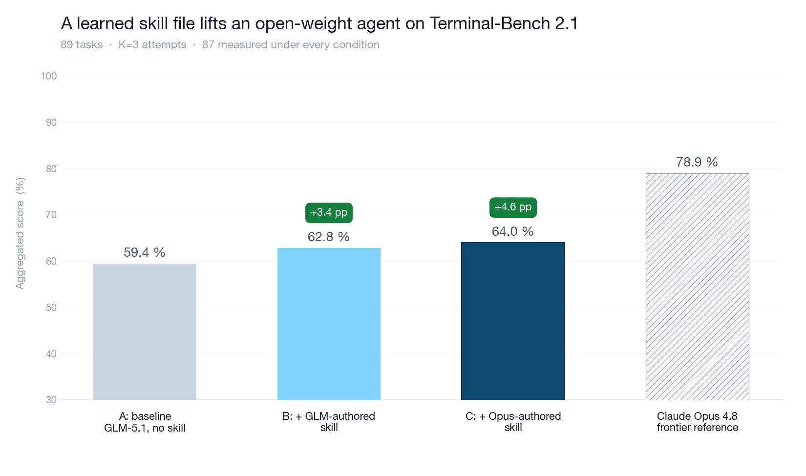

# AI agents are amnesiacs.

**Solving amnesia for coding agents — results from Terminal-Bench 2.1.**

*Post 1 of 3 in the ContinuumAI series. Published 2026-06-02.*

## The amnesiac problem

Pick any coding agent you might be using — *Cursor, Claude Code, Aider, OpenHands, Codex, whatever your platform team is building in-house* — and they all share one structural property: **no memory across sessions.**

Each task starts from scratch. The agent works through the problem, makes mistakes, eventually finishes (or doesn't), and then everything it learned evaporates the moment the conversation ends.

There are partial fixes you've probably tried: longer context windows that let the agent see more within a single session; project-level rules files (Cursor's `.cursorrules`, Claude Code's `CLAUDE.md`, Aider conventions, etc.); RAG-style retrieval over your docs and codebase; persistent chat memory features built into the agent platform. All of them are ad-hoc — written by hand, maintained by hand, updated whenever a developer remembers to add the gotcha they just hit. The agent itself never contributes to any of them. Whatever it learns in a session evaporates the moment the chat ends, and the next session starts from whatever a human happened to write down yesterday.

**For an individual developer this is annoying:**

- Your agent reaches for `pip` even though your repo has been on `uv` since spring — or for `jest` even though you migrated to `vitest` last quarter — every new session, same wrong tool, fresh
- It re-proposes the dead-end approach you and your team explicitly rejected on Slack three weeks ago, because nothing in its context remembers any of that
- You spend more time re-explaining the project's basics — *which logger, which test runner, which branch ships to prod, where the deploy script actually lives* — than you spend on the actual change you opened the chat for

**For an engineering team it's all of the above, multiplied across N engineers — plus a few more:**

- Every engineer's agent runs through the same gotcha library independently
- The skill your senior engineer's agent acquired last quarter does **not** transfer to the junior engineer's agent next quarter
- Your humans build up institutional knowledge across PRs, postmortems, design reviews, and onboarding wikis — and there's no equivalent for agents
- ***Human knowledge compounds, but agentic knowledge does not.***

This is the recurring pattern in agent pilots: useful out of the gate, then a plateau that never quite breaks. The agent keeps doing the same tasks and keeps getting tripped up by the same things. A bigger model would knock out some of those — but it wouldn't fix the underlying issue, which is that nothing carries from one session to the next.

That structural part doesn't go away with a model upgrade. It goes away when the system starts remembering.

**And throwing a bigger model at it doesn't help.** Frontier models can already chew through most Terminal-Bench 2.1 tasks if you give them enough tokens. Capability isn't the bottleneck. The bottleneck is that nothing about the *system around the model* carries yesterday's lesson into today.

What's missing is the five-line note your senior engineer would jot down after spending forty minutes on a gotcha. That's all a skill is, really.

## What ContinuumAI does

ContinuumAI is an attempt at giving agents memory across sessions. When a session ends, the loop reads the trajectory, pulls out the lesson that mattered most, and saves it as a short file the next session can read. No human in the middle, no manual curation.

Here's the loop:

Each session adds one short Markdown file to the library. No model weights touched, no vector store, no human curation step — just plain text in a folder you can grep, version in git, or move to a different platform whenever you want.

## The compounding cost advantage

While agents keep starting from zero, **every session is paying to rediscover the same things**. The dollar cost gets ugly fast: a team running thousands of agent sessions a day across hundreds of engineers is paying for the same gotcha to get rediscovered, session after session after session. The wall-clock cost is worse — every developer sits there waiting while the agent re-treads ground that's already been covered.

**Once you capture the lesson once, that cost is paid once.**

| Audience | What changes |
|---|---|
| **Individual developer** | An hour saved every time a repeated gotcha shows up; an agent that grows quietly sharper at *your* stack week after week |
| **Engineering organization** | The monthly agent inference bill drops (Post 2 will quantify this). Institutional knowledge becomes something you can capture, replay, and audit — the same way commits are. And team-wide compounding starts kicking in across every PR. |

This is the unusual part: **the product gets more useful the longer you run it. No model upgrade required.**

## Measuring it on Terminal-Bench 2.1

Picking the benchmark mattered. It needed to:

1. **Test multi-step, long-horizon agent work** — so a skill has real content to encode
2. **Have a published frontier reference** — so any lift is interpretable
3. **Allow clean K-run aggregation** — so the numbers are comparable across teams

[Terminal-Bench 2.1](https://www.tbench.ai/leaderboard/terminal-bench/2.1) fits all three. 89 long-horizon coding and systems tasks: SQLite-WAL recovery, build-chain debugging, image-processing pipelines, reverse-engineering puzzles, network-protocol implementations, environment-configuration problems. Each task has a programmatic verifier. The current leaderboard top is *Codex CLI + GPT-5.5* at 83.4 %; second is *Claude Code + Opus 4.8* at **78.9 %**. Both run on frontier closed models.

The experiment used **GLM-5.1 as the executor** across three conditions:

- **A — baseline**: GLM-5.1 with no skill loaded
- **B — GLM-authored skill**: GLM-5.1 reads a SKILL.md authored by GLM-5.1 from its own prior failure
- **C — Opus-authored skill**: GLM-5.1 reads a SKILL.md authored by Claude Opus 4.6 from the same prior failure

K=3 attempts per task. TB-standard aggregated score. 87 of 89 tasks measured under every condition.

### Results

| Stack | TB-2.1 aggregated score | Lift vs baseline |
|---|---|---|
| Claude Opus 4.8 (leaderboard #2) | 78.9 % | *frontier reference* |
| **A**: GLM-5.1 baseline (no skill) | **59.4 %** | — |
| **B**: GLM-5.1 + GLM-authored skill | **62.8 %** | **+3.4 %** |
| **C**: GLM-5.1 + Opus-authored skill | **64.0 %** | **+4.6 %** |

**+4.6 %** is the headline — from one failure trajectory per task, no refinement loop, no validation gate, on a benchmark this hard.

There's clear room to push that number higher. The loop here is the simplest version of itself by design, and several refinements are already queued up for the next iterations — validation gating chief among them. What matters at this point is the signal that the loop works at all on a hard benchmark with an open-weight executor, and it does.

### Two findings from the run worth flagging

**🔑 The author model matters less than you'd expect.**
Self-authoring (GLM-5.1 writing its own skills, B) captures *about three-quarters* of the lift that Opus-authoring (C) provides. The skill is the asset; the author is a multiplier on it, not a gate to it. What this means in practice:

- Individual developers and small teams can run the whole loop on a cheap open-weight model — *no frontier API call required, ever*
- Enterprises with privacy constraints have a defensible *"no need to send private trajectories to a frontier API"* answer
- The economics don't depend on any single model vendor staying cheap

**⚠️ Some skills regress their target tasks.**
A handful of tasks where the unaided baseline already passed 2 of 3 attempts ended up passing only 1 of 3 once a skill was loaded. The current loop ships every skill the author produces — *no validation gate yet* — so this is the expected hiccup of the simplest version. Adding the gate (the iterative-refinement approach in [2]) is the next iteration, and it should knock most of these regressions out.

## References

[1] Letta (2026). [*Skill Learning*](https://www.letta.com/blog/skill-learning).

[2] Microsoft Research (2026). [*SkillOpt: Optimizing Natural-Language Skills as the Trainable State of Frozen Agents*](https://microsoft.github.io/SkillOpt/). [arXiv:2605.23904](https://arxiv.org/abs/2605.23904).

## Conclusion

An automatic skill-generation loop like this one — no model weights touched, no human curation, one short Markdown file per failed session — takes an open-weight executor to roughly **80 % of the top frontier model's score** on Terminal-Bench 2.1 (64.0 % vs 78.9 %), at a fraction of the inference cost.

More details on the cost side in **Post 2**. **Post 3** walks through individual SKILL.md files — what each one teaches, the failure trajectory that produced it, and the cases where the loop wrote a skill that hurt instead of helping.
