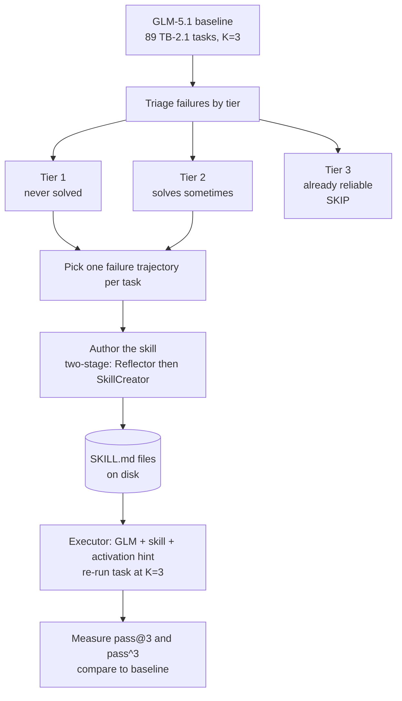
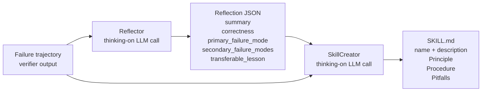
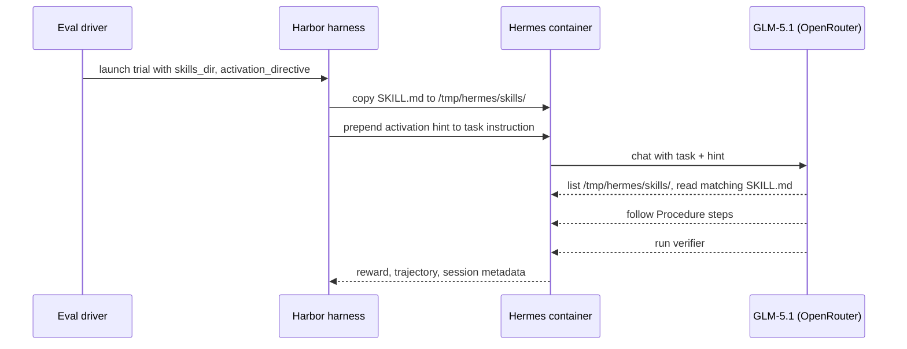

# Skill Generation Methodology

## What we're doing in one sentence

Given a benchmark task where an agent failed, we **read its failure trajectory, extract the single load-bearing mistake, and write a short reusable Markdown file (SKILL.md)** that a future agent loads at run time to avoid repeating the mistake.

## End-to-end pipeline



Three things to notice:

1. **Skills only target tasks where baseline left room** (T1 + T2). T3 tasks are already reliable; skills there could only improve efficiency, not pass rate.
2. **Authoring is two stages**, not one — the reflection step is a separate LLM call from the writing step.
3. **The executor is unchanged across baseline and skill conditions** (same model, same thinking, same activation hint format). The *only* thing that varies is whether a custom SKILL.md is mounted.

## Authoring: the two stages



**Why split?** The Reflector's job is *analysis* — pick **one** load-bearing failure (not a list). The SkillCreator's job is *writing* — produce a tight Markdown file in the agentskills.io format. Letta reported their +9pp lift collapses if you fold both into a single call; we adopt their split.

**Hardening (added during Day 20):** the Reflector now has a tolerant JSON extractor and a 2-tier auto-retry (a polite reminder, then an assistant-message prefill) so flaky JSON output from the author doesn't lose a skill. Before the hardening, 1–2 of every 18 skills were silently dropped to parse errors.

## SKILL.md format (enforced by the SkillCreator prompt + a `validate_skill` check)

| Section | Rule |
| - | - |
| Frontmatter `name` | kebab-case, ≤ 64 chars |
| Frontmatter `description` | starts with "When …" or "Triggers on …"; ≤ 1024 chars |
| `## Principle` | 1–2 sentences explaining the conceptual failure |
| `## Procedure` | ≤ 5 numbered steps with concrete commands |
| `## Common pitfalls` | optional |
| `## When NOT to use` | optional |
| Body | ≤ 80 lines hard cap |
| Code blocks | **no literal task-specific values** — placeholders only (`<TARGET_PATH>`, `${PREFIX}`) so the skill generalizes |

## Two author models compared

```mermaid
flowchart LR
    TRAJ[(Failure<br/>trajectories)]
    TRAJ --> B_AUTH[Author = GLM-5.1<br/>OpenRouter + reasoning param]
    TRAJ --> C_AUTH[Author = Opus 4.6<br/>Anthropic SDK + thinking]
    B_AUTH --> B_SKILLS[B: skills/day20-tier*-glm/]
    C_AUTH --> C_SKILLS[C: skills/day20-tier*-opus/]
    B_SKILLS --> EX[Executor: GLM no-skill-author]
    C_SKILLS --> EX
    EX --> RES[pass@3 and pass^3 per task]
```

| | Method B | Method C |
| - | - | - |
| Author model | GLM-5.1 | Claude Opus 4.6 |
| Reasoning | OpenRouter `extra_body.reasoning={"effort":"high"}` — fires (600–9990 reasoning tokens per skill) | Anthropic `thinking={"type":"enabled","budget_tokens":4096}` — native |
| API path | OpenAI SDK → OpenRouter via `OpenRouterAnthropicShim` | Anthropic SDK direct |
| Generator cost | ~$1 / skill | ~$1–2 / skill (Opus is pricier) |
| Result | More conversions overall, less reliable | Fewer conversions, more reliable (more pass^3) |

The shim (`src/lla/learning/glm_client.py`) presents an Anthropic-SDK-shaped `client.messages.create(...)` surface backed by an OpenAI client pointed at OpenRouter. This lets the same `Reflector`/`SkillCreator` classes drive either author with one parameter change. It also handles the GLM "only-thinking-blocks" failure mode (empty `content` → fall back to the `reasoning` field).

## How the skill reaches the executor



The activation hint is the same one used in Day 15+: a short prefix that tells the agent to enumerate `/tmp/hermes/skills/` and apply any matching `SKILL.md` before starting the task. Without the hint, models reliably *ignore* the skills directory.

## How to reproduce

```bash
# 1. Baseline (no skill) on the full 89-task TB 2.1 set
uv run python scripts/eval_glm_no_skill_tb21_full.py

# 2. Triage into tiers (writes tier1_ready.json / tier2_ready.json)
#    Inlined helper run from aggregate_live_results.py setup section.

# 3. Author skills with both methods, both tiers (4 parallel generation runs)
uv run python scripts/generate_glm_skills_tier1.py
uv run python scripts/generate_glm_skills_tier2.py
uv run python scripts/generate_opus_skills_tier1.py
uv run python scripts/generate_opus_skills_tier2.py

# 4. Run the executors (GLM + skill + hint, K=3)
uv run python scripts/eval_glm_tier1_with_skills.py
uv run python scripts/eval_opus_tier1_with_skills.py
uv run python scripts/eval_glm_tier2_with_skills.py
uv run python scripts/eval_opus_tier2_with_skills.py

# 5. Live results dashboards (poll the disk, regenerate every 2 min)
uv run python scripts/aggregate_live_results.py &        # Tier 1
uv run python scripts/aggregate_live_results_tier2.py &  # Tier 2
```

## Methodology footnote — the 30-min agent budget was silently mismeasuring

Hermes' default per-task agent budget is 1800 s (30 min). When we re-ran the 23 "failed" tasks at 3600 s with K=1, **15 of 23 (65%) actually solved** — they were budget-starved, not failed. This adds **+3.7 pp** to the *true* baseline before any skill is applied, and required us to redefine Tier 1/2 membership after the recovery pass (see [03-all-improvements.md](03-all-improvements.md)). The recovery pass also salvaged failure trajectories for two tasks that had previously produced none, unblocking skill generation for them.

The methodological lesson: when classifying a task as "model can't solve" vs "model needs longer," a single budget setting risks conflating the two. The cheap recovery experiment (one extra K=1 attempt at 2× budget per failed task) is worth running before any skill-authoring round.

## Observability footnote — `reasoning_tokens=0` is a Hermes reporting artifact

Every Hermes session JSONL records `reasoning_tokens: 0` even when reasoning was active end-to-end. Hermes' `usage_pricing.py` reads reasoning from `output_tokens_details` (Anthropic convention), but OpenRouter returns it under `completion_tokens_details` (OpenAI convention) — so the counter never increments. The dollar billing IS computed correctly from OpenRouter's line items: median session cost is **1.9×** what no-reasoning would predict, confirming reasoning fired. **All results in this report set are with thinking active.** No Hermes patch is required.

## References

- [Letta — Skill Learning blog](https://www.letta.com/blog/skill-learning) — the two-stage authoring design we replicate
- [agentskills.io spec](https://agentskills.io) — SKILL.md file format
- [Terminal-Bench 2.1 leaderboard](https://www.tbench.ai/leaderboard/terminal-bench/2.1)
- Sibling reports: [Case studies](02-case-studies.md) · [All improvements](03-all-improvements.md)
